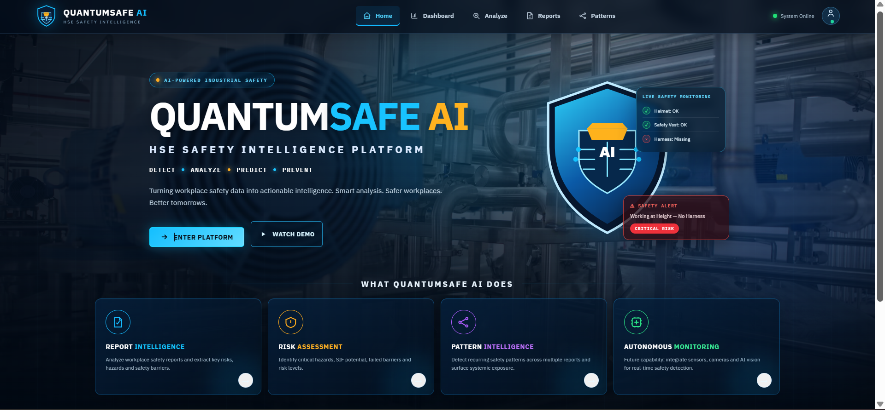
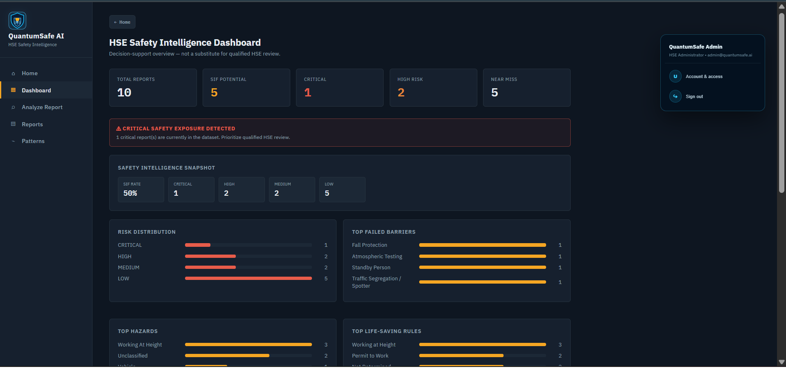
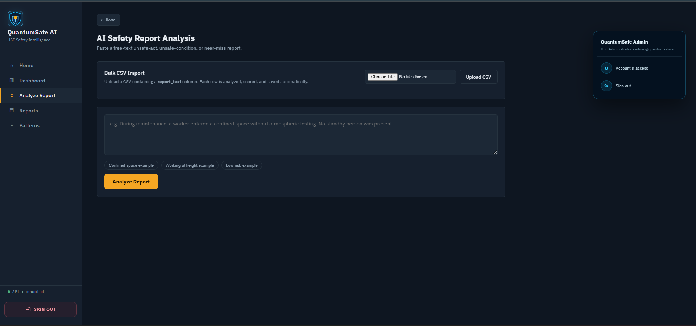
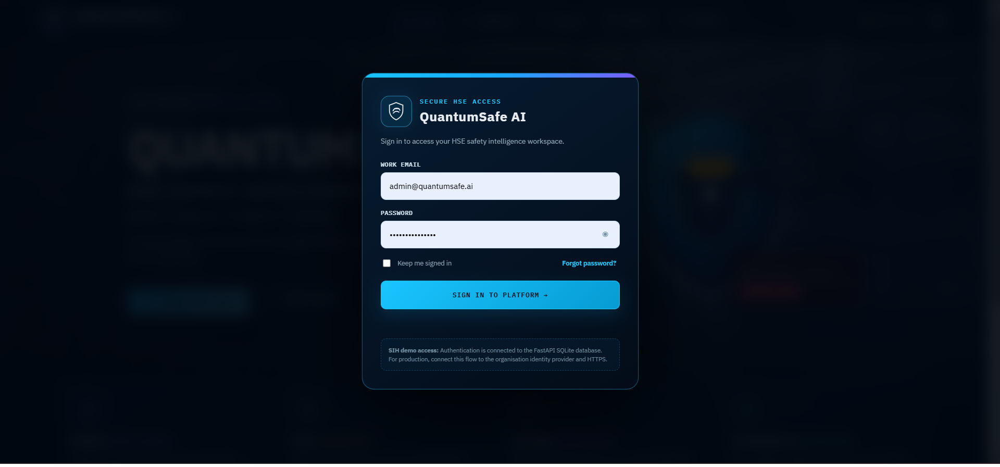
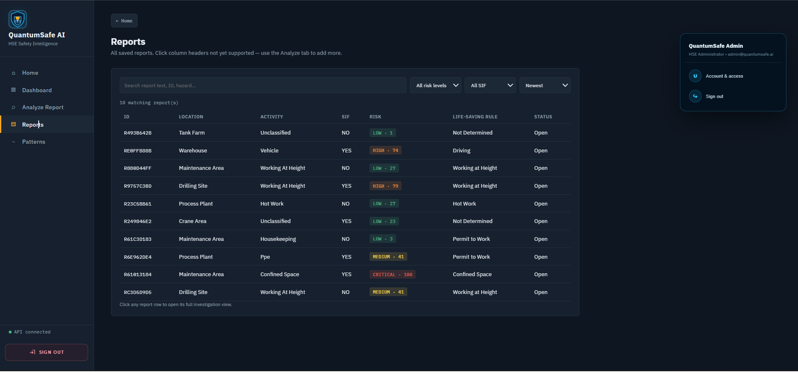

# QuantumSafe AI — HSE Safety Intelligence Platform

### SIH 2026 | Problem Statement: SIH26165

QuantumSafe AI is an AI-assisted **HSE Safety Intelligence Platform** designed for Oil India Limited (OIL) to identify **Serious Injury & Fatality (SIF) precursors** from unsafe-act, unsafe-condition and near-miss safety reports.

Instead of only storing safety reports, QuantumSafe AI converts free-text reports into structured safety intelligence, helping HSE professionals prioritize potentially serious exposures, understand failed safety barriers, investigate reports and identify recurring safety patterns across historical data.

---

## 🎯 Problem We Address

Safety reports often contain valuable information in free-text form.

When an organization has hundreds or thousands of reports, manually reading every report makes it difficult to consistently identify:

- Potential SIF precursors
- High-risk situations
- Repeated hazards
- Failed safety barriers
- Recurring safety patterns
- Locations or activities showing repeated exposure

QuantumSafe AI adds an intelligence layer to this process.

### Core workflow

```text
Safety Report
      ↓
AI / NLP Analysis
      ↓
SIF Potential Detection
      ↓
Risk Assessment
      ↓
Hazard & Activity Extraction
      ↓
Failed Barrier Identification
      ↓
Database Storage
      ↓
Dashboard & Reports
      ↓
Pattern Intelligence
      ↓
Investigation & Corrective Action
```

---

## 🚀 Key Features

### 1. Report Intelligence

Analyze a free-text safety report and extract structured information such as:

- Activity
- Hazard
- SIF potential
- Confidence
- Risk score
- Risk level
- Life-Saving Rule
- Failed safety barriers
- Explanation
- Recommendation

### 2. Risk Assessment

Each analyzed report receives a risk-oriented assessment using:

- Risk score
- LOW
- MEDIUM
- HIGH
- CRITICAL

The risk framework is a **prototype decision-support framework** and is not claimed to be an official OIL risk methodology.

### 3. SIF Precursor Detection

The system identifies reports containing conditions, unsafe acts or control failures that may have the potential to contribute to a serious injury or fatality.

The system is intended to **prioritize HSE review**. It does not replace qualified HSE professionals and does not claim to predict incidents with certainty.

### 4. Failed Barrier Detection

QuantumSafe AI identifies safety controls that appear to be missing, ineffective or bypassed in a report.

Examples include:

- Fall protection
- Atmospheric testing
- Standby person
- Permit to work
- Isolation
- PPE
- Gas detection

### 5. Pattern Intelligence

The platform analyzes multiple stored reports to identify recurring safety signals.

Patterns can be surfaced using combinations such as:

```text
Hazard + Location + Failed Barrier
```

The system can highlight:

- Number of related reports
- Number of SIF-potential reports
- SIF ratio
- Risk level
- Related report IDs

### 6. Live Safety Dashboard

The dashboard is database-driven and provides:

- Total reports
- SIF-potential reports
- Critical reports
- High-risk reports
- Near misses
- Risk distribution
- Top hazards
- Top failed barriers
- Top Life-Saving Rules
- Other aggregated safety indicators

### 7. Reports & Investigation

Stored reports can be searched and reviewed using:

- Report ID
- Report text
- Report type
- Date
- Location
- Activity
- Hazard
- SIF potential
- Confidence
- Risk score
- Risk level
- Life-Saving Rule
- Failed barrier
- Status

Investigation statuses include:

```text
Open
Under Review
Investigation
Action Required
Resolved
```

### 8. Bulk CSV Import

Historical safety reports can be imported using CSV files.

Typical fields include:

```text
report_text
report_type
date
location
```

### 9. Authentication

The platform includes backend-backed authentication using:

- Password hashing
- Session tokens
- Protected API endpoints
- Login
- Logout
- Session validation

#### Demo Account

```text
Email:    admin@quantumsafe.ai
Password: QuantumSafe@123
Role:     HSE Administrator
```

The password is not stored as plain text in the database.

---

## 🧠 System Architecture

```text
                    QUANTUMSAFE AI
                         │
                ┌────────▼────────┐
                │   WEB FRONTEND  │
                │  HTML/CSS/JS    │
                └────────┬────────┘
                         │
                      REST API
                         │
                ┌────────▼────────┐
                │  FASTAPI SERVER │
                ├─────────────────┤
                │ Authentication  │
                │ Report Analysis │
                │ Risk Assessment │
                │ Report Storage  │
                │ Dashboard API   │
                │ Pattern Engine  │
                │ Investigation   │
                └────────┬────────┘
                         │
                 ┌───────▼───────┐
                 │   SQLite DB   │
                 ├───────────────┤
                 │ reports       │
                 │ users         │
                 │ sessions      │
                 └───────────────┘
```

---

## 🛠️ Technology Stack

| Layer | Technology |
|---|---|
| Frontend | HTML, CSS, JavaScript |
| Backend | Python, FastAPI |
| Database | SQLite |
| Data Validation | Pydantic |
| NLP / Analysis | Python safety-analysis pipeline |
| Pattern Detection | Python |
| Bulk Data | CSV |
| Authentication | PBKDF2-SHA256 + session tokens |
| API Documentation | FastAPI / Swagger |

---

## 📂 Project Structure

```text
quantumsafe-ai/
│
├── backend/
│   ├── app/
│   │   ├── main.py
│   │   ├── data/
│   │   │   ├── taxonomy.py
│   │   │   ├── generate_synthetic_data.py
│   │   │   └── synthetic_reports.csv
│   │   ├── models/
│   │   │   ├── train_classifier.py
│   │   │   └── sif_classifier.joblib
│   │   └── services/
│   │       ├── extraction.py
│   │       ├── classifier.py
│   │       ├── risk_engine.py
│   │       ├── explain.py
│   │       ├── pattern_detection.py
│   │       └── pipeline.py
│   ├── tests/
│   │   └── smoke_test_pipeline.py
│   └── requirements.txt
│
├── frontend/
│   └── index.html
│
├── docs/
│   └── screenshots/
│       ├── 01-home-dashboard.png
│       ├── 02-login.png
│       ├── 03-home-landing.png
│       ├── 04-analyze-report.png
│       └── 05-reports-investigation.png
│
├── README.md
└── .gitignore
```

> The local SQLite database is intentionally excluded from Git using `.gitignore`.

---

## ▶️ Running the Project

### 1. Backend

From the project root:

```bash
cd backend
```

Create and activate a virtual environment.

#### Windows

```bash
python -m venv venv
venv\Scripts\activate
```

#### macOS / Linux

```bash
python3 -m venv venv
source venv/bin/activate
```

Install dependencies:

```bash
pip install -r requirements.txt
```

Start the FastAPI server:

```bash
uvicorn app.main:app --reload --port 8000
```

The application will be available at:

```text
http://localhost:8000/
```

FastAPI Swagger documentation:

```text
http://localhost:8000/docs
```

### 2. Frontend

Open:

```text
http://localhost:8000/
```

The current prototype serves the frontend through FastAPI so the UI and API run on the same origin.

---

## 🧪 Testing

The project includes a smoke-test pipeline.

From the backend directory:

```bash
python tests/smoke_test_pipeline.py
```

---

## 🎬 Suggested SIH Demo Flow

```text
1. Login
      ↓
2. Home
      ↓
3. Enter Platform
      ↓
4. Analyze Safety Report
      ↓
5. Show SIF + Risk + Failed Barriers
      ↓
6. Save Report
      ↓
7. Open Dashboard
      ↓
8. Open Reports
      ↓
9. Investigate Report
      ↓
10. Update Status
      ↓
11. Open Pattern Intelligence
      ↓
12. Explain Recurring Safety Pattern
```

---

## 📊 Example Safety Report

Example input:

```text
During maintenance work at the processing plant, a worker
was operating at height without proper fall protection.
The harness was not connected and no standby person was present.
```

Illustrative output:

```text
Activity:
Working at Height

Hazard:
Working at Height / Fall Exposure

SIF Potential:
YES

Risk:
HIGH / CRITICAL

Failed Barriers:
Fall Protection
Standby Person
```

---

## 🔬 AI / NLP Pipeline

```text
Raw Text
   ↓
Text Processing
   ↓
Safety Signal Extraction
   ↓
Hazard / Activity Detection
   ↓
SIF Classification
   ↓
Risk Scoring
   ↓
Life-Saving Rule Mapping
   ↓
Barrier Failure Detection
   ↓
Explanation & Recommendation
```

The frontend provides the user interface while the analysis is performed by the backend pipeline.

---

## 📈 Pattern Intelligence

The pattern engine operates across multiple stored reports:

```text
Stored Reports
      ↓
Group Related Safety Signals
      ↓
Hazard + Location + Failed Barrier
      ↓
Count Occurrences
      ↓
Count SIF Reports
      ↓
Calculate SIF Ratio
      ↓
Rank Recurring Patterns
```

This changes the system from a simple reporting database into an organizational safety-intelligence tool.

---

## 📸 Application Screenshots

### 🔐 Login & Authentication



### 🏭 QuantumSafe AI Home



### 🧠 AI Safety Report Analysis



### 📊 HSE Safety Intelligence Dashboard



### 📋 Reports & Investigation



---

## ⚠️ Prototype Limitations

QuantumSafe AI is a prototype intended for SIH demonstration and further development.

Important limitations:

- Prototype risk thresholds are not official OIL methodology.
- AI results should be reviewed by qualified HSE professionals.
- Synthetic-data results should not be interpreted as real-world model performance.
- Production-scale enterprise integration is not yet implemented.
- Autonomous camera / IoT monitoring is a future extension.

---

## 🔮 Future Scope

### Advanced ML

Transformer-based safety classification using more diverse and representative safety-report datasets.

### Automated Alerts

Red/amber safety alerts generated from emerging pattern trends.

### Computer Vision

Integration with CCTV/video analytics for real-time safety observation.

### IoT / Sensors

Integration with industrial sensors and connected safety equipment.

### Enterprise Deployment

Integration with enterprise HSE systems and production infrastructure.

---

## 🎯 Vision

QuantumSafe AI aims to move workplace safety intelligence from:

```text
Reactive Reporting
```

towards:

```text
Predictive / Proactive Safety Intelligence
```

by identifying recurring warning signals and failed safety barriers before they become serious incidents.

---

## 👥 SIH Team

**Project:** QuantumSafe AI  
**SIH Problem Statement:** SIH26165  
**Focus:** HSE Safety Intelligence / SIF Precursor Detection

---

## 📌 Important Presentation Statement

> **QuantumSafe AI does not just detect unsafe reports — it converts safety reports into actionable HSE intelligence.**
